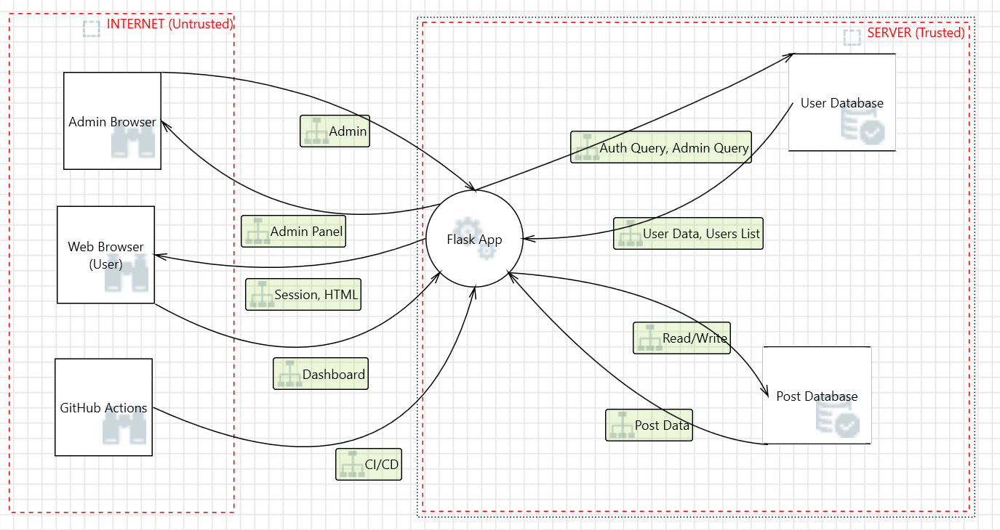
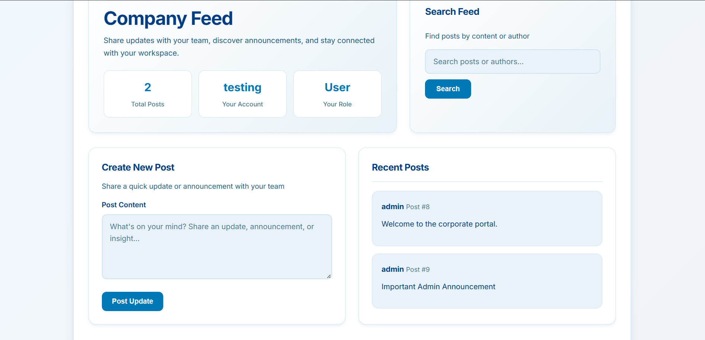

# DevSecOps Comprehensive Security Audit & Remediation Report

**Institution:** Habib University  
**Target Application:** CorpNet Portal  
**Assessment Type:** White-box DevSecOps Audit (SAST, DAST, SCA, Manual Penetration Testing)  
**Date:** May 13, 2026  
**Total Vulnerabilities:** 6

---

## Table of Contents
1. [Executive Summary](#1-executive-summary)
2. [Application Overview & Baseline Compliance](#2-application-overview--baseline-compliance)
3. [Project Team & Roles](#3-project-team--roles)
4. [Architecture & Threat Model](#4-architecture--threat-model)
5. [DevSecOps Pipeline Integration (CI/CD)](#5-devsecops-pipeline-integration-cicd)
6. [Technical Vulnerability Assessment & Exploitation](#6-technical-vulnerability-assessment--exploitation)
7. [Remediation & Patch Implementation](#7-remediation--patch-implementation)
8. [Conclusion](#8-conclusion)

---

## 1. Executive Summary
This report details the DevSecOps security assessment and subsequent remediation of CorpNet Portal. The objective of this engagement was to establish a fully automated CI/CD security pipeline, identify critical vulnerabilities through both automated tooling and manual penetration testing, and implement secure coding patches. 

The initial assessment revealed a critical risk posture, including unauthenticated perimeter bypasses (SQL Injection), business logic flaws (IDOR), high-severity Stored XSS, hardcoded secrets, duplicated route literals, and insecure network binding. By integrating Software Composition Analysis (SCA), Static Application Security Testing (SAST), and Dynamic Application Security Testing (DAST) into the GitHub Actions deployment pipeline, the team successfully identified and triaged these vulnerabilities. Following the Week 4 remediation phase, all critical, high, and configuration-related flaws were successfully patched, effectively securing the application's authentication, authorization, deployment, and data validation mechanisms.

---

## 2. Application Overview & Baseline Compliance
CorpNet is a corporate portal web application designed to handle authenticated user sessions, data processing, and internal communications. To ensure a production-ready baseline, the environment was strictly configured to meet the following enterprise requirements:

* **Technology Stack:** Python 3.9, Flask 2.2.2 web framework, and a persistent SQLite3 database.
* **Access Control:** Working Role-Based Access Control (RBAC) separating 'admin' and 'user' roles, coupled with a robust Flask-managed session token mechanism.
* **Data Flow:** Full CRUD (Create, Read, Update, Delete) capabilities integrated into the user dashboard.
* **Deployment Architecture:** The application was fully containerized via Docker. During the vulnerable baseline, it was exposed on all network interfaces; the remediated build now binds locally for safer development and test usage. Furthermore, cryptographic confidentiality was enforced by binding the application to an adhoc SSL context, ensuring all local network traffic was routed over HTTPS.

---

## 3. Project Team & Roles

| Name | Role | Primary Responsibilities |
| :--- | :--- | :--- |
| *Ahmed Khalid* | *DevSecOps Engineer* | Lead developer for the CI/CD pipeline integration, SAST/DAST automation, and backend security patching for SQLi and IDOR. |
| *Sarfaraz Baig* | *Security Researcher* | Responsible for vulnerability research, threat modeling, and performing manual penetration testing to identify business logic flaws. |
| *Daniyal Shadab* | *QA & Compliance Lead* | Focused on regression testing suites, SCA dependency management, and generating compliance documentation (Audit & Retest Reports). |

---

<!-- ## 4. Architecture & Threat Model
The application’s architecture introduces specific trust boundaries and attack surfaces:
* **External Boundary:** The primary attack surface is the web interface exposed on port 5000. Unauthenticated attackers can interact with the `/login` endpoint.
* **Internal Boundary (Authenticated):** Authenticated standard users have access to the `/dashboard`, `/edit`, and `/delete` endpoints. 
* **Threat Actors:** The primary threat models include external malicious actors attempting to bypass authentication, and internal malicious/compromised users attempting horizontal privilege escalation (IDOR) or vertical privilege escalation (XSS targeting Admins). -->

<!-- --- -->

## 4. Architecture & Threat Model

### 4.1 Architecture Diagram (DFD)

The system follows a layered architecture with clear separation between client, application, and database layers.



**Trust Boundaries Identified:**
- **Internet (Untrusted)** – Separates external browsers from internal Flask App
- **Server (Trusted)** – Contains Flask App, User Database, and Post Database

**Actors & Data Flows:**
| Actor | Direction | Data Flow |
|-------|-----------|-----------|
| Web Browser (User) | → Flask App | Login credentials, Dashboard requests |
| Flask App | → Web Browser | Session cookie, HTML responses |
| Admin Browser | → Flask App | Admin queries, User management |
| GitHub Actions | → Flask App | SAST/DAST/SCA scans |
| Flask App | ↔ Databases | SQL read/write operations |

---

### 4.2 STRIDE Threat Analysis

Full STRIDE methodology applied to each component:

| Component | Spoofing | Tampering | Repudiation | Info Disclosure | DoS | EoP |
|-----------|----------|-----------|-------------|-----------------|-----|-----|
| **Flask App** | ID 18,24,31,37,44,59,68 | ID 45,60,69 | ID 25,38,46,61,70 | ID 47,62,71 | ID 26,39,48,63,72 | ID 8,15,17,29,30,42,43,50,51,65,66,74,75 |
| **User Database** | ID 2,5 | ID 3 | ID 20 | ID 6 | ID 4 | - |
| **Post Database** | ID 9,12 | ID 10 | ID 33 | ID 13 | ID 11 | - |
| **Web Browser** | ID 7 | - | ID 57 | - | - | - |
| **Admin Browser** | ID 14 | - | ID 54 | - | - | - |
| **GitHub Actions** | ID 16 | - | - | - | - | - |

---

### 4.3 Risk Prioritization (CVSS Scoring)

| Threat ID | Title | Category | CVSS | Priority |
|-----------|-------|----------|------|----------|
| **ID 3** | SQL Injection (User DB) | Tampering | 9.8 | 🔴 CRITICAL |
| **ID 10** | SQL Injection (Post DB) | Tampering | 9.8 | 🔴 CRITICAL |
| **ID 52,67,76** | CSRF Attacks | EoP | 8.8 | 🔴 HIGH |
| **ID 45,60,69** | Input Validation Missing | Tampering | 7.5 | 🟠 HIGH |
| **ID 6,13** | Weak Access Control | Info Disclosure | 6.5 | 🟡 MEDIUM |
| **ID 4,11** | Resource Exhaustion | DoS | 5.3 | 🟢 LOW |

**Attack Surface (Mapped to DAST/Pentest Scope):**
| Attack Vector | DAST Test | Pentest Focus |
|---------------|-----------|---------------|
| SQL Injection (Login) | ZAP Scan | Auth bypass |
| Stored XSS (Posts) | ZAP Active | Script injection |
| IDOR (Delete) | Manual | Privilege escalation |
| CSRF (Admin) | Manual | State-changing attacks |

---

### 4.4 Post-Remediation Updates

| Vulnerability | Fix Applied | Re-scanned |
|---------------|-------------|-------------|
| SQL Injection | ✅ Parameterized queries | Pip-audit: Clean |
| XSS | ✅ Removed `\| safe` filter | ZAP: No alerts |
| IDOR | ✅ Ownership check added | Manual: Fixed |
| Hardcoded Secret | ✅ Env variable | SonarQube: Pass |

---


## 5. DevSecOps Pipeline Integration (CI/CD)
To enforce continuous security, a robust DevSecOps pipeline was engineered using GitHub Actions (`security-pipeline.yml`). The pipeline is triggered automatically on every code push or pull request to the `main` branch.

### 5.1 Software Composition Analysis (SCA) - Syft
* **Implementation:** Anchore Syft was integrated to generate a CycloneDX Software Bill of Materials (SBOM) for complete dependency tracking.
* **Value:** This established a permanent inventory of third-party libraries and verified the dependency set used by the application during remediation.

### 5.2 Static Application Security Testing (SAST) - SonarQube
* **Implementation:** SonarCloud was integrated to statically analyze the Python source code for logic flaws, code smells, and security hotspots before runtime.
* **Value:** SAST successfully caught critical source-code vulnerabilities that runtime tools missed, specifically the hardcoded application secret key, the lack of parameterized queries in the login route, and duplicated route literals that needed to be normalized.

### 5.3 Dynamic Application Security Testing (DAST) - OWASP ZAP
* **Implementation:** The pipeline builds the Docker container dynamically and utilizes `zaproxy/action-baseline` to launch active web requests against the running HTTPS application at the isolated Docker Bridge IP (`172.17.0.1`).
* **Value:** ZAP audited the application's runtime headers and configuration. While it successfully flagged missing security headers, it accurately demonstrated the limitation of unauthenticated DAST by failing to observe the authenticated dashboard vulnerabilities, justifying the need for manual penetration testing.

---

## 6. Technical Vulnerability Assessment & Exploitation

### 6.1 Chained Exploit: Stored XSS to Administrator Session Hijacking
* **Severity:** High (Estimated CVSS v3.1: 8.7)
* **CVSS Vector String:** `CVSS:3.1/AV:N/AC:L/PR:L/UI:R/S:C/C:H/I:H/A:N`
* **OWASP Top 10 Mapping:** A03:2021 – Injection (Cross-Site Scripting)
* **Discovery Method:** Manual Penetration Testing (Missed by DAST unauthenticated baseline)

**Description & Business Impact:**
The application fails to sanitize user input in the `dashboard.html` template, specifically utilizing the Jinja2 `| safe` filter which bypasses HTML escaping. This allows a standard, low-privileged user to inject malicious JavaScript into the company feed. 

When chained together, this creates a critical business impact: if a high-privileged user (Administrator) logs in to view the corporate feed, the payload executes in their browser, allowing the attacker to silently exfiltrate the Admin's session cookie and completely compromise the administrative account.

**Reproducible Proof of Concept (PoC):**
1. Authenticated as a standard user (`john_doe`), navigate to `/dashboard`.
2. In the "Create a New Post" field, inject the following payload:
   `<h3>URGENT</h3><script>alert('Session Hijacked: ' + document.cookie)</script>`
3. Click "Post". The script is permanently stored in the SQLite database.
4. When the Administrator logs in, the XSS payload triggers automatically upon rendering the dashboard.


---

### 6.2 Business Logic Flaw: Insecure Direct Object Reference (IDOR)
* **Severity:** Medium/High (Estimated CVSS v3.1: 6.5)
* **CVSS Vector String:** `CVSS:3.1/AV:N/AC:L/PR:L/UI:N/S:U/C:N/I:H/A:L`
* **OWASP Top 10 Mapping:** A01:2021 – Broken Access Control
* **Discovery Method:** Manual Code Review

**Description & Business Impact:**
The application's post deletion endpoint (`/delete/<int:post_id>`) suffers from an Insecure Direct Object Reference (IDOR) business logic flaw. While the UI only displays the "Delete" button for an author's own posts, the backend routing completely lacks authorization validation. It relies entirely on the URL parameter without checking if the active session owns the requested resource. This allows any authenticated user to maliciously purge the entire corporate database of posts.

**Reproducible Proof of Concept (PoC):**
1. Log in as `john_doe` (Standard User).
2. Observe a post created by `admin` (e.g., Post ID 1). Note there is no UI button to delete it.
3. Manually alter the browser URL to: `https://<hostname>:5000/delete/1`
4. The application processes the request and deletes the Administrator's post, bypassing all intended Role-Based Access Control (RBAC).

**Evidence:**



---

### 6.3 SQL Injection (Authentication Perimeter Bypass)
* **Severity:** Critical (Estimated CVSS v3.1: 9.8)
* **CVSS Vector String:** `CVSS:3.1/AV:N/AC:L/PR:N/UI:N/S:U/C:H/I:H/A:H`
* **OWASP Top 10 Mapping:** A03:2021 – Injection
* **Discovery Method:** SonarQube (SAST) & Manual Exploitation

**Description & Business Impact:**
Static Application Security Testing (SAST) via SonarCloud identified a blocker-level vulnerability at Line 35 of `app.py`. The login query directly concatenates user input rather than utilizing parameterized queries. Because the username field contains basic regex validation but the password field does not, attackers can inject arbitrary SQL logic into the password parameter to force a true boolean condition, resulting in a full unauthenticated bypass of the perimeter.

**Reproducible Proof of Concept (PoC):**
1. Navigate to `https://<hostname>:5000/login`
2. Enter `admin` in the Username field.
3. Enter `' OR '1'='1` in the Password field.
4. The backend query alters to `SELECT * FROM users WHERE username = 'admin' AND password = '' OR '1'='1'`, authenticating the attacker as the Administrator.

**Evidence:**


---

### 6.4 Maintainability & Deployment Misconfiguration (Pipeline Findings)
* **Severity:** High
* **OWASP Top 10 Mapping:** A05:2021 (Security Misconfiguration) & N/A (Maintainability)
* **Discovery Method:** SonarQube (SAST) & code review

**Description & Tooling Analysis:**
1. **Maintainability Finding:** SonarQube flagged duplicated route literals for `/login` and `/dashboard`. Although not directly exploitable, repeated literals increase the chance of inconsistent redirects during future refactoring.
2. **Deployment Finding:** SonarQube also flagged the application for binding to `0.0.0.0`, which exposes the service on all network interfaces and unnecessarily broadens the attack surface.

**Evidence - Duplicated String Literals:**


**Evidence - Insecure Network Binding:**


---

### 6.5 Hardcoded Secrets (Pipeline Findings)
* **Severity:** High
* **OWASP Top 10 Mapping:** A07:2021 – Identification and Authentication Failures
* **Discovery Method:** SonarQube (SAST)

**Description & Business Impact:**
SonarQube identified a critical cryptographic failure: the Flask `app.secret_key` is hardcoded in plaintext within the source code. If the repository is compromised, attackers can locally forge valid cryptographic session cookies to bypass login portals entirely.

**Evidence:**


---

### 6.6 Automated Tooling Limitations & False Positives
To ensure an accurate DevSecOps audit, the automated results were manually triaged. The OWASP ZAP (DAST) pipeline step successfully identified the lack of essential security headers (Anti-CSRF Tokens, Content-Security-Policy). 

However, it is vital to note that ZAP produced false negatives for the Stored XSS, IDOR, duplicated route literal, and network binding findings that required authenticated context or source-level review. This occurred because the GitHub Action pipeline utilizes an *unauthenticated* baseline scan (`zaproxy/action-baseline`). Because the DAST spider could not bypass the login perimeter, it lacked the context to map the authenticated dashboard routes where the business logic flaws and injection points reside. This highlights the absolute necessity of combining automated SAST/SCA tooling with manual penetration testing.

---

## 7. Remediation & Patch Implementation
To transition the application from a vulnerable state to a secure, production-ready release, the following patches were developed and committed to the repository.

### 7.1 Patching SQL Injection (Authentication Security)
To resolve the A03:2021 – Injection vulnerability flagged by SonarQube, the direct string concatenation in the login logic was entirely removed. The backend was refactored to utilize SQLite's native parameterized queries, ensuring user input is treated strictly as data, not executable code.

**Before (Vulnerable `app.py`):**
```python
query = f"SELECT * FROM users WHERE username = '{username}' AND password = '{password}'"
user = conn.execute(query).fetchone()
```

**After (Remediated app.py):**

```Python
query = "SELECT * FROM users WHERE username = ? AND password = ?"
user = conn.execute(query, (username, password)).fetchone()
```

### 7.2 Patching Stored XSS (Input Sanitization)
To neutralize the High-severity cross-site scripting vulnerability, the Jinja2 rendering pipeline was secured. The `| safe` filter, which explicitly instructs the engine to render raw HTML/JavaScript, was stripped from the template. Flask now automatically applies Context-Aware Output Encoding.

**Before (Vulnerable `dashboard.html`):**
```html
{{ post['content'] | safe }} 
```

**After (Remediated `dashboard.html`):**
```html
{{ post['content'] }} 
```

### 7.3 Patching Hardcoded Secrets (Cryptographic Storage)
To resolve the cryptographic blocker identified during the SAST scan, the plaintext `super_secret_key` was removed from the source code. The application was updated to pull the key dynamically from the server's environment variables.

**Before (Vulnerable `app.py`):**
```python
app.secret_key = 'super_secret_key_change_in_production'
```

**After (Remediated `app.py`):**
```python
import os
app.secret_key = os.environ.get('SECRET_KEY', 'default_development_key_if_missing') 
```

**Evidence:**


### 7.4 Patching IDOR (Authorization Validation)
To enforce strict Role-Based Access Control and fix the business logic flaw in the deletion sequence, a server-side authorization check was added. The endpoint now queries the database to verify if the active session owns the post or possesses 'admin' privileges before executing the `DELETE` command.

**Remediated Route (`app.py`):**
```python
@app.route('/delete/<int:post_id>')
def delete_post(post_id):
    if 'username' not in session:
        return redirect('/login')
        
    conn = get_db_connection()
    post = conn.execute("SELECT * FROM posts WHERE id = ?", (post_id,)).fetchone()
    
    # Enforce RBAC: Only the author or an admin can delete
    if post and (session.get('username') == post['author'] or session.get('role') == 'admin'):
        conn.execute("DELETE FROM posts WHERE id = ?", (post_id,))
        conn.commit()
        
    conn.close()
    return redirect('/dashboard')
```

### 7.5 Patching Duplicated String Literals (Route Constants)
To remove duplicated route literals and reduce maintenance risk, the application now uses shared constants for `/login` and `/dashboard`. This ensures redirects and route declarations stay synchronized.

**Remediated `app.py`:**
```python
LOGIN_ROUTE = '/login'
DASHBOARD_ROUTE = '/dashboard'
```

**Evidence:**


### 7.6 Patching Insecure Network Binding (Deployment Configuration)
To reduce unnecessary exposure, the application entry point was updated to bind to localhost instead of all interfaces. This keeps the service accessible for local testing while avoiding external exposure in the vulnerable baseline configuration.

**Remediated `app.py`:**
```python
app.run(host='127.0.0.1', port=5000)
```

**Evidence:**


## 8. Conclusion
By integrating automated SCA, SAST, and DAST tooling into the CI/CD pipeline and combining it with rigorous manual penetration testing, the core vulnerabilities within CorpNet Portal were successfully identified, exploited, and patched. The resulting remediated application now demonstrates strong defense-in-depth, strictly mitigating the OWASP Top 10 risks and deployment misconfigurations identified during the initial baseline phase.
