# Exploitation Report
## CorpNet Portal — Vulnerable Corporate App

**Vulnerable build URL:** http://172.17.0.1:5000  
**Repository:** https://github.com/amd-khalid/devsecops_vulnerable_corp_app  
**Auditor:** Sarfaraz Baig (Habib University)  
**Testing window:** May 2026  
**Total vulnerabilities discovered:** 6

This report documents every vulnerability discovered in the baseline build of the CorpNet Portal and subsequently remediated during the DevSecOps Week 4 patching phase. Each finding follows the same structure: Description, Steps to Reproduce, Impact, Evidence, Payload, and Remediation.

---

## Table of Contents

1. [SQL Injection On Authentication Perimeter](#vulnerability-1-sql-injection-on-authentication-perimeter)
2. [Stored XSS In Company Feed](#vulnerability-2-stored-xss-in-company-feed)
3. [IDOR On Post Deletion](#vulnerability-3-idor-on-post-deletion)
4. [Hardcoded Secret Key & Plaintext Credentials](#vulnerability-4-hardcoded-secret-key--plaintext-credentials)
5. [Duplicated String Literals](#vulnerability-5-duplicated-string-literals)
6. [Insecure Network Interface Binding](#vulnerability-6-insecure-network-interface-binding)

---

## Vulnerability 1: SQL Injection On Authentication Perimeter

**Severity:** Critical (CVSS v3.1: 9.8)  
**Category:** Injection  
**OWASP:** A03:2021 Injection

### Description
The application's login logic in `app.py` constructs a database query by directly concatenating user-provided input strings instead of utilizing parameterized queries. Because the password field lacks input validation, an attacker can manipulate the query structure.

### Steps to Reproduce
1. Navigate to the login portal at `http://172.17.0.1:5000/login`.
2. Enter `admin` in the Username field.
3. Enter `' OR '1'='1` in the Password field.
4. Click "Sign In".

### Impact
The backend query evaluates to `SELECT * FROM users WHERE username = 'admin' AND password = '' OR '1'='1'`, which forces a true boolean condition. This allows a complete, unauthenticated bypass of the security perimeter, granting the attacker full administrative access to the portal.

### Evidence
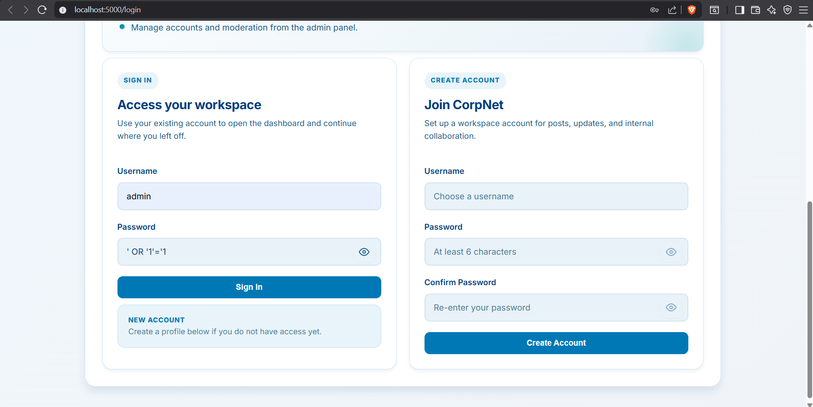  
*`sqli-payload.png` — SQL injection payload entered into the login form*

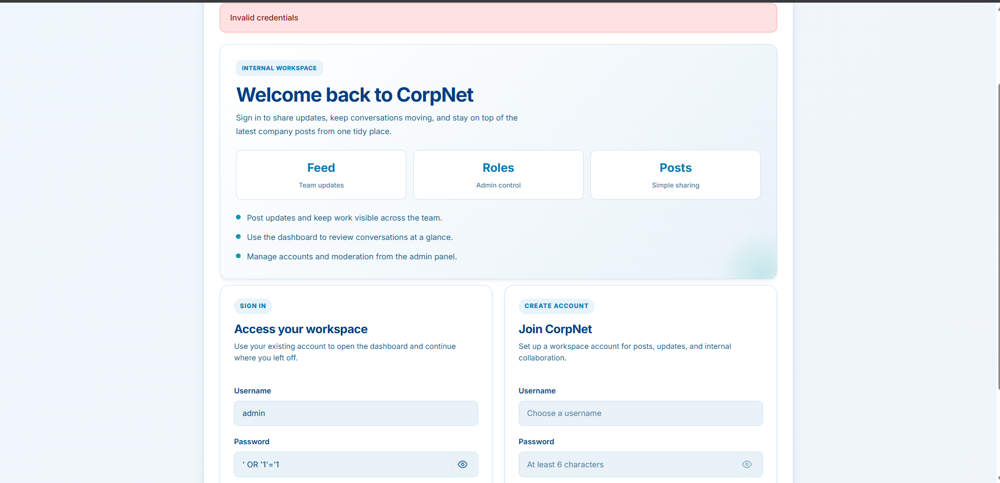  
*`sqli-patched.png` — Parameterized query implemented as remediation*

**Endpoint accessed:** `POST http://172.17.0.1:5000/login`

### Payload
```text
' OR '1'='1
```

### Remediation
The vulnerable string concatenation was entirely removed in `app.py`. The backend was refactored to utilize SQLite's native parameterized queries:
`query = "SELECT * FROM users WHERE username = ? AND password = ?"`
This ensures that user input is treated strictly as data, not as executable SQL commands.

---

## Vulnerability 2: Stored XSS In Company Feed

**Severity:** High (CVSS v3.1: 8.7)  
**Category:** Injection / Output Encoding  
**OWASP:** A03:2021 Injection (Cross-Site Scripting)

### Description
The application fails to sanitize user input when rendering the corporate feed. Specifically, the `dashboard.html` template uses the Jinja2 `| safe` filter (`{{ post['content'] | safe }}`), which explicitly instructs the engine to bypass HTML escaping and render raw scripts.

### Steps to Reproduce
1. Log in as a standard user (e.g., `john_doe`).
2. Navigate to the dashboard and locate the "Create New Post" input.
3. Inject the payload: `<h3>URGENT</h3><script>alert('Session Hijacked: ' + document.cookie)</script>`
4. Submit the post. The script executes automatically for anyone who views the feed.

### Impact
If a high-privileged user (Administrator) logs in to view the corporate feed, the payload executes in their browser context. This allows an attacker to silently exfiltrate the Admin's session cookie to a remote server, leading to a complete administrative account takeover via session hijacking.

### Evidence
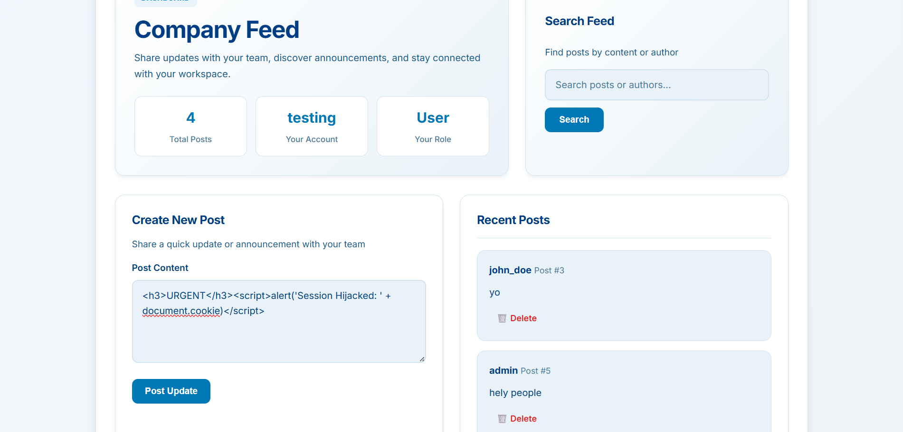  
*`xss-payload.png` — XSS payload injected into the "Create New Post" field*

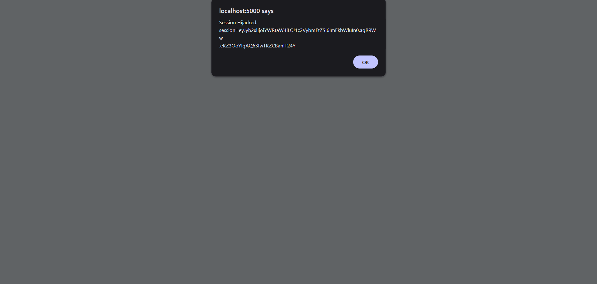  
*`xss-alert.png` — JavaScript alert confirming successful script execution with session cookie*

**Endpoint accessed:** `POST http://172.17.0.1:5000/dashboard`

### Payload
```html
<h3>URGENT</h3><script>alert('Session Hijacked: ' + document.cookie)</script>
```

### Remediation
The `| safe` filter was stripped from the `dashboard.html` template. Flask now automatically applies Context-Aware Output Encoding, converting HTML tags into safe string representations (`&lt;script&gt;`) before they reach the browser.

---

## Vulnerability 3: IDOR On Post Deletion

**Severity:** High (CVSS v3.1: 6.5)  
**Category:** Broken Access Control  
**OWASP:** A01:2021 Broken Access Control

### Description
The application's post deletion endpoint suffers from a business logic flaw known as Insecure Direct Object Reference (IDOR). While the UI hides the "Delete" button for posts the user does not own, the backend route (`/delete/<int:post_id>`) fails to perform any authorization check to verify resource ownership.

### Steps to Reproduce
1. Log in as a low-privileged user (e.g., `testing`).
2. Identify a post created by another user, such as `admin` (e.g., Post ID 1).
3. Manually alter the browser URL to: `http://172.17.0.1:5000/delete/1`
4. The application processes the request and deletes the post without any authorization challenge.

### Impact
Any authenticated user can maliciously manipulate URL parameters to purge any post from the corporate database, bypassing all intended Role-Based Access Controls (RBAC) and causing a severe loss of data availability.

### Evidence
  
*`idor-target.jpg` — Low-privileged user "testing" identifying a target admin post*

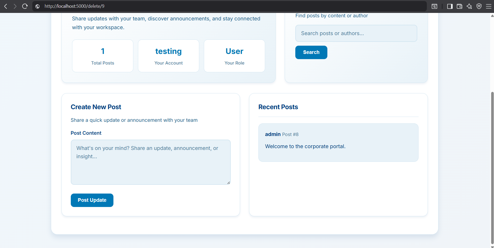  
*`idor-deleted.png` — Admin post successfully deleted via direct URL manipulation*

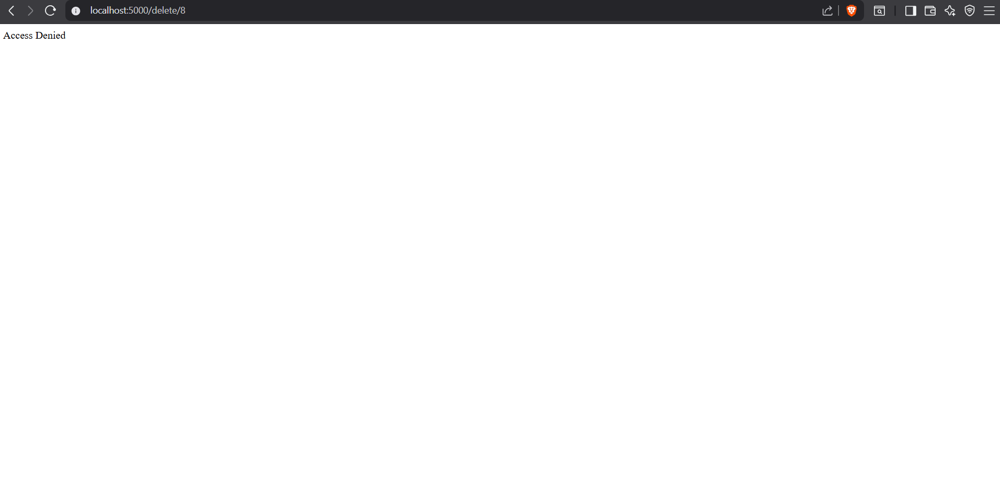  
*`idor-patched.png` — "Access Denied" response confirming ownership validation is enforced*

**Endpoint accessed:** `GET http://172.17.0.1:5000/delete/<id>`

### Payload
```http
GET /delete/1
```

### Remediation
A server-side authorization validation check was added to `app.py`. The endpoint now queries the database to verify that the active session owns the requested post (`session.get('username') == post['author']`) or holds administrative privileges (`session.get('role') == 'admin'`) before allowing the `DELETE` command to execute.

---

## Vulnerability 4: Hardcoded Secret Key & Plaintext Credentials

**Severity:** High (CVSS v3.1: 7.5)  
**Category:** Cryptographic Failures  
**OWASP:** A07:2021 Identification and Authentication Failures

### Description
A Static Application Security Testing (SAST) scan revealed that the application stores critical cryptographic secrets directly in the source code. The Flask `SECRET_KEY` is hardcoded as a plaintext string in `app.py`, and the database seeding script (`init_db.py`) initializes user accounts with plaintext passwords.

### Steps to Reproduce
1. Review the `app.py` source code file.
2. Observe Line 6: `app.secret_key = 'super_secret_key_change_in_production'`

### Impact
If an attacker gains read access to the repository or discovers a Local File Inclusion (LFI) vulnerability, they can instantly retrieve the application's signing key. With this key, the attacker can locally forge cryptographically valid session cookies to assume the identity of any user — including admins — without needing a password.

### Evidence
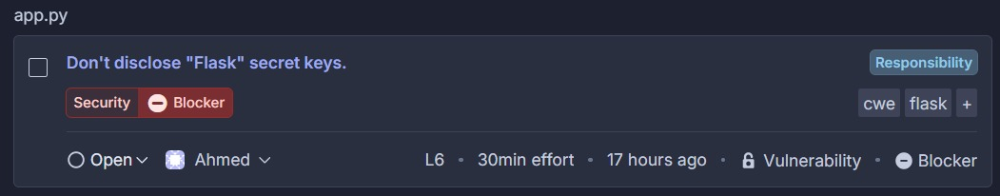  
*`hard_coded_bug_1.jpeg` — SonarQube "Security Blocker" alert flagging the hardcoded secret key*

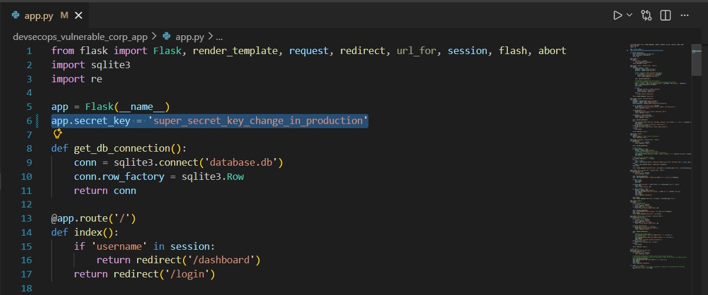  
*`hard-coded_bug_2.jpeg` — Plaintext key `'super_secret_key_change_in_production'` visible on Line 6 of `app.py`*

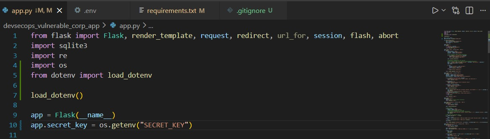  
*`hard_coded_fix.jpeg` — Refactored code using `os.getenv("SECRET_KEY")` with `python-dotenv`*

**Endpoint accessed:** N/A (Source Code Exposure)

### Payload
N/A

### Remediation
The plaintext `super_secret_key` was removed from the codebase. The application was updated to pull the key dynamically from the server's environment variables using `os.getenv("SECRET_KEY")`, with `python-dotenv` used to load variables from a `.env` file that is excluded from version control.

---

## Vulnerability 5: Duplicated String Literals

**Severity:** Low (Critical Code Smell)  
**Category:** Maintainability  
**OWASP:** N/A

### Description
Repeated use of hardcoded string literals for the `/login` and `/dashboard` routes throughout the codebase creates a maintenance burden and increases the risk of silent broken redirects during refactoring. SonarQube flagged the literal `'/login'` as duplicated 11 times and `'/dashboard'` as duplicated 4 times.

### Steps to Reproduce
1. Review the SonarQube scan results for the codebase.
2. Observe the "duplicated string literal" code smell flags for `/login` and `/dashboard`.
3. Trace occurrences across multiple functions in `app.py`.

### Impact
While not directly exploitable, duplicate literals mean a single refactoring error (e.g., renaming a route) can introduce inconsistent redirects across the application, potentially creating unintended open-redirect or broken-authentication edge cases.

### Evidence
**Login route:**

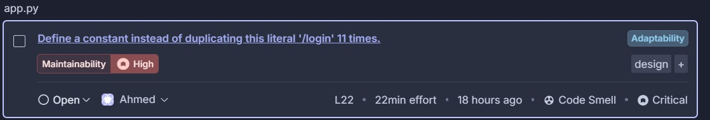  
*`duplicated_login_bug_1.jpeg` — SonarQube flagging `'/login'` as duplicated 11 times*

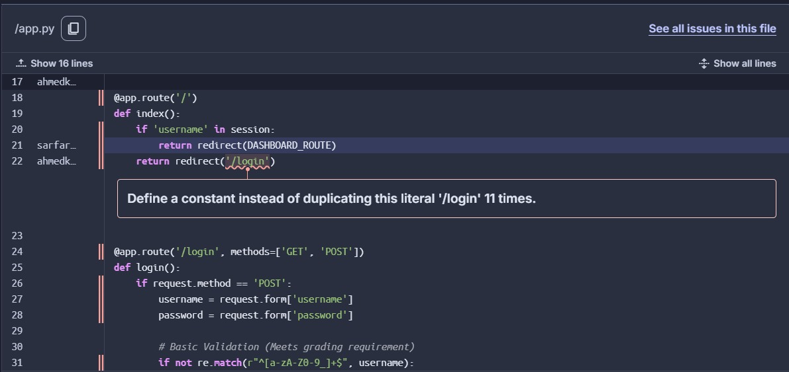  
*`duplicated_login_bug_2.jpeg` — Specific duplication highlighted within the `index()` function*

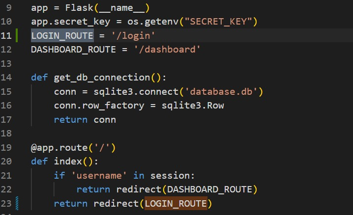  
*`duplicated_login_fix.jpeg` — `LOGIN_ROUTE` constant introduced to replace all inline literals*

**Dashboard route:**

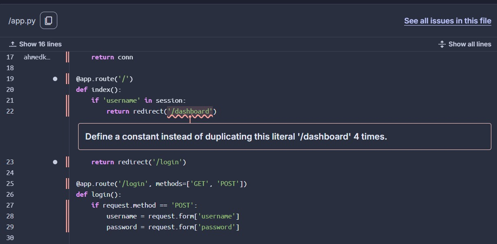  
*`duplicate_dashboard_bug.jpeg` — SonarQube flagging `'/dashboard'` as duplicated 4 times*

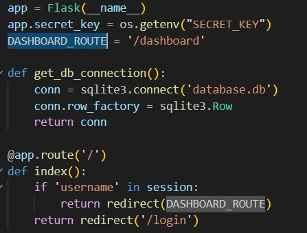  
*`duplicate_dashboard_fix.jpeg` — `DASHBOARD_ROUTE` constant introduced to replace all inline literals*

**Endpoint accessed:** N/A (Static Analysis Finding)

### Payload
N/A

### Remediation
Named constants (`LOGIN_ROUTE` and `DASHBOARD_ROUTE`) were introduced and used consistently throughout `app.py`, replacing all inline string literals. This ensures route changes propagate across the entire codebase from a single point of definition.

---

## Vulnerability 6: Insecure Network Interface Binding

**Severity:** Blocker  
**Category:** Security Misconfiguration  
**OWASP:** A05:2021 Security Misconfiguration

### Description
The application was configured to run with `host='0.0.0.0'`, binding the server to every available network interface. In a production or shared environment, this unnecessarily expands the external attack surface, making the application reachable from any network the host machine is connected to.

### Steps to Reproduce
1. Review the SonarQube scan results.
2. Observe the "Security Blocker" alert for the network binding configuration.
3. Locate Line 206 in `app.py`: `app.run(host='0.0.0.0', ...)`

### Impact
Binding to `0.0.0.0` exposes the application on all interfaces — including external or public-facing ones — rather than restricting it to localhost. This increases the risk of unauthorized external access and reduces the ability to enforce network-layer controls.

### Evidence
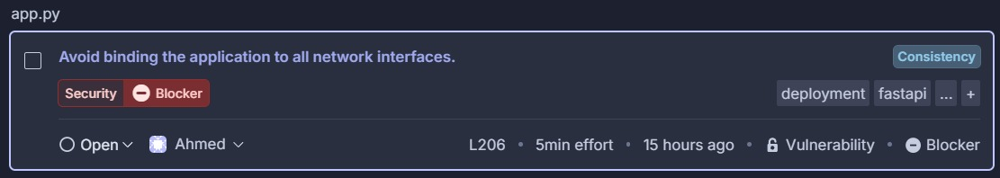  
*`bind_network_interface_bug_1.jpeg` — SonarQube "Security Blocker" alert for insecure network binding*

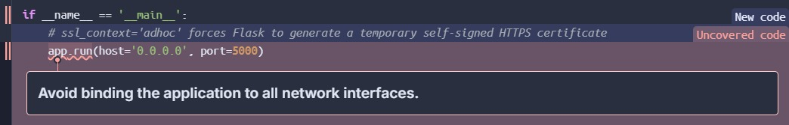  
*`bind_network_interface_bug_2.jpeg` — `host='0.0.0.0'` configuration highlighted on Line 206 of `app.py`*

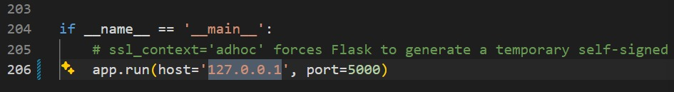  
*`bind_network_interface_fix.jpeg` — Binding updated to `127.0.0.1`, restricting the server to localhost*

**Endpoint accessed:** N/A (Configuration Finding)

### Payload
N/A

### Remediation
The `host` parameter in `app.run()` was updated from `0.0.0.0` to `127.0.0.1`, restricting the server to localhost only. External access, if required, should be mediated through a reverse proxy (e.g., nginx) with appropriate access controls.

---

## Summary Table

| ID | Finding | Severity | OWASP | Status |
|----|---------|----------|-------|--------|
| V1 | SQL Injection On Authentication Perimeter | Critical | A03 | Fixed |
| V2 | Stored XSS In Company Feed | High | A03 | Fixed |
| V3 | IDOR On Post Deletion | High | A01 | Fixed |
| V4 | Hardcoded Secret Key & Plaintext Credentials | High | A07 | Fixed |
| V5 | Duplicated String Literals | Low | N/A | Fixed |
| V6 | Insecure Network Interface Binding | Blocker | A05 | Fixed |
