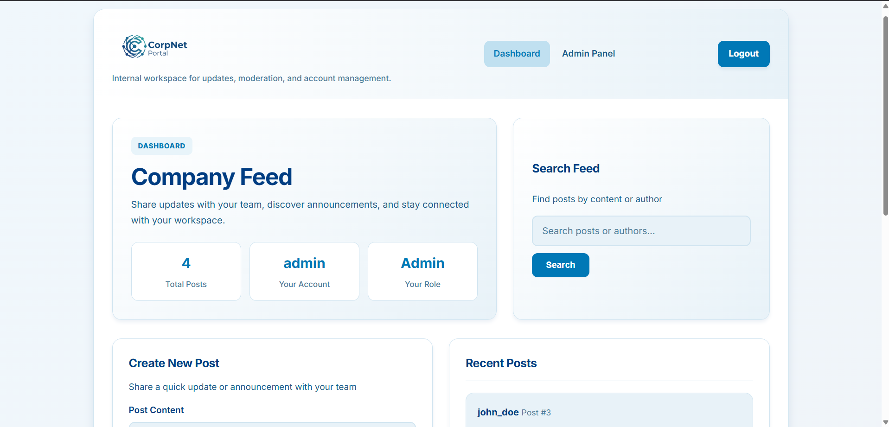

# Exploitation Report
## CorpNet Portal — Vulnerable Corporate App

**Vulnerable build URL:** http://172.17.0.1:5000  
**Repository:** https://github.com/amd-khalid/devsecops_vulnerable_corp_app  
**Testing window:** May 2026  
**Total vulnerabilities discovered:** 5

This report documents every vulnerability that was discovered in the baseline build of the CorpNet Portal and subsequently remediated during the DevSecOps Week 4 patching phase. Each finding follows the same structure: Description, Steps to Reproduce, Impact, Evidence, Payload, and Remediation.

---

## Table of Contents

1. [SQL Injection On Authentication Perimeter](#vulnerability-1-sql-injection-on-authentication-perimeter)
2. [Stored XSS In Company Feed](#vulnerability-2-stored-xss-in-company-feed)
3. [IDOR On Post Deletion](#vulnerability-3-idor-on-post-deletion)
4. [Hardcoded Secret Key & Plaintext Credentials](#vulnerability-4-hardcoded-secret-key--plaintext-credentials)
5. [Vulnerable Third-Party Dependency](#vulnerability-5-vulnerable-third-party-dependency)

---

## Vulnerability 1: SQL Injection On Authentication Perimeter

**Severity:** Critical (CVSS v3.1: 9.8)  
**Category:** Injection  
**OWASP:** A03:2021 Injection

### Description
The application's login logic in `app.py` constructs a database query by directly concatenating user-provided input strings instead of utilizing parameterized queries. Because the password field lacks input validation, an attacker can manipulate the query structure.

### Steps to Reproduce
1. Navigate to the login portal at `http://172.17.0.1:5000/login`.
2. Enter `admin` in the Username field.
3. Enter `' OR '1'='1` in the Password field.
4. Click "Sign In".

### Impact
The backend query evaluates to `SELECT * FROM users WHERE username = 'admin' AND password = '' OR '1'='1'`, which forces a true boolean condition. This allows a complete, unauthenticated bypass of the security perimeter, granting the attacker full administrative access to the portal.

### Evidence



**Endpoint accessed:** `POST http://172.17.0.1:5000/login`

### Payload
```text
' OR '1'='1
```

### Remediation
The vulnerable string concatenation was entirely removed in `app.py`. The backend was refactored to utilize SQLite's native parameterized queries:
`query = "SELECT * FROM users WHERE username = ? AND password = ?"`
This ensures that user input is treated strictly as data, not as executable SQL commands.

---

## Vulnerability 2: Stored XSS In Company Feed

**Severity:** High (CVSS v3.1: 8.7)  
**Category:** Injection / Output Encoding  
**OWASP:** A03:2021 Injection (Cross-Site Scripting)

### Description
The application fails to sanitize user input when rendering the corporate feed. Specifically, the `dashboard.html` template uses the Jinja2 `| safe` filter (`{{ post['content'] | safe }}`), which explicitly instructs the engine to bypass HTML escaping and render raw scripts.

### Steps to Reproduce
1. Log in as a standard user (e.g., `john_doe`).
2. Navigate to the dashboard and locate the "Create New Post" input.
3. Inject the payload: `<h3>URGENT</h3><script>alert('Session Hijacked: ' + document.cookie)</script>`
4. Submit the post. The script executes automatically for anyone who views the feed.

### Impact
If a high-privileged user (Administrator) logs in to view the corporate feed, the payload executes in their browser context. This allows an attacker to silently exfiltrate the Admin's session cookie to a remote server, leading to a complete administrative account takeover (Session Hijacking).

### Evidence


**Endpoint accessed:** `POST http://172.17.0.1:5000/dashboard`

### Payload
```html
<h3>URGENT</h3><script>alert('Session Hijacked: ' + document.cookie)</script>
```

### Remediation
The `| safe` filter was stripped from the `dashboard.html` template. Flask now automatically applies Context-Aware Output Encoding, converting HTML tags into safe string representations (`&lt;script&gt;`) before they reach the browser.

---

## Vulnerability 3: IDOR On Post Deletion

**Severity:** Medium/High (CVSS v3.1: 6.5)  
**Category:** Broken Access Control  
**OWASP:** A01:2021 Broken Access Control

### Description
The application's post deletion endpoint suffers from a business logic flaw known as Insecure Direct Object Reference (IDOR). While the UI hides the "Delete" button for posts the user does not own, the backend route (`/delete/<int:post_id>`) fails to perform authorization checks to verify resource ownership.

### Steps to Reproduce
1. Log in as a standard user (`john_doe`).
2. Identify a post created by another user, such as `admin` (e.g., Post ID 1).
3. Manually alter the browser URL to: `http://172.17.0.1:5000/delete/1`
4. The application processes the request and deletes the post.

### Impact
Any authenticated user can maliciously manipulate the URL parameters to purge the entire corporate database of posts, bypassing all intended Role-Based Access Controls (RBAC) and causing a severe loss of data availability.

### Evidence


**Endpoint accessed:** `GET http://172.17.0.1:5000/delete/<id>`

### Payload
```http
GET /delete/1
```

### Remediation
A server-side authorization validation check was added to `app.py`. The endpoint now queries the database to verify if the active session owns the requested post (`session.get('username') == post['author']`) or possesses administrative privileges (`session.get('role') == 'admin'`) before allowing the `DELETE` command to execute.

---

## Vulnerability 4: Hardcoded Secret Key & Plaintext Credentials

**Severity:** High (CVSS v3.1: 7.5)  
**Category:** Cryptographic Failures  
**OWASP:** A07:2021 Identification and Authentication Failures

### Description
A Static Application Security Testing (SAST) scan revealed that the application stores critical cryptographic secrets directly in the source code. The Flask `app.secret_key` is hardcoded in plaintext, and the database seeding script (`init_db.py`) initializes user accounts with plaintext passwords.

### Steps to Reproduce
1. Review the `app.py` source code file.
2. Observe Line 6: `app.secret_key = 'super_secret_key_change_in_production'`

### Impact
If an attacker gains read access to the repository or discovers a Local File Inclusion (LFI) vulnerability, they can instantly retrieve the application's signing key. With this key, the attacker can locally forge cryptographically valid session cookies to assume the identity of any user (including admins) without needing a password.

### Evidence


**Endpoint accessed:** N/A (Source Code Exposure)

### Payload
N/A

### Remediation
The plaintext `super_secret_key` was removed from the codebase. The application was updated to pull the key dynamically from the server's environment variables using `os.environ.get('SECRET_KEY')`. 

---

## Vulnerability 5: Vulnerable Third-Party Dependency

**Severity:** High (CVSS v3.1: 7.5)  
**Category:** Vulnerable and Outdated Components  
**OWASP:** A06:2021 Vulnerable and Outdated Components

### Description
The Software Composition Analysis (SCA) pipeline utilizing Syft generated an SBOM that identified an outdated component locked in `requirements.txt`: `Werkzeug==2.2.2`. 

### Steps to Reproduce
1. Review the generated `sbom-report.json` artifact from the GitHub Actions pipeline.
2. Cross-reference the identified `Werkzeug 2.2.2` package against public CVE databases.

### Impact
This specific version of Werkzeug is susceptible to a known high-severity Denial of Service (DoS) vulnerability (CVE-2023-25577). An attacker can send specially crafted multipart form data, causing the server to consume excessive resources and crash, disrupting the portal's availability for all corporate users.

### Evidence


**Endpoint accessed:** N/A

### Payload
N/A

### Remediation
The `requirements.txt` file must be updated to utilize a patched, secure version of the `Werkzeug` library (e.g., `>=2.2.3`), followed by a container rebuild and deployment.

---

## Summary Table

| ID | Finding | Severity | OWASP | Status |
|----|---------|----------|-------|--------|
| V1 | SQL Injection On Authentication Perimeter | Critical | A03 | Fixed |
| V2 | Stored XSS In Company Feed | High | A03 | Fixed |
| V3 | IDOR On Post Deletion | Medium/High | A01 | Fixed |
| V4 | Hardcoded Secret Key & Plaintext Credentials | High | A07 | Fixed |
| V5 | Vulnerable Third-Party Dependency | High | A06 | Pending |