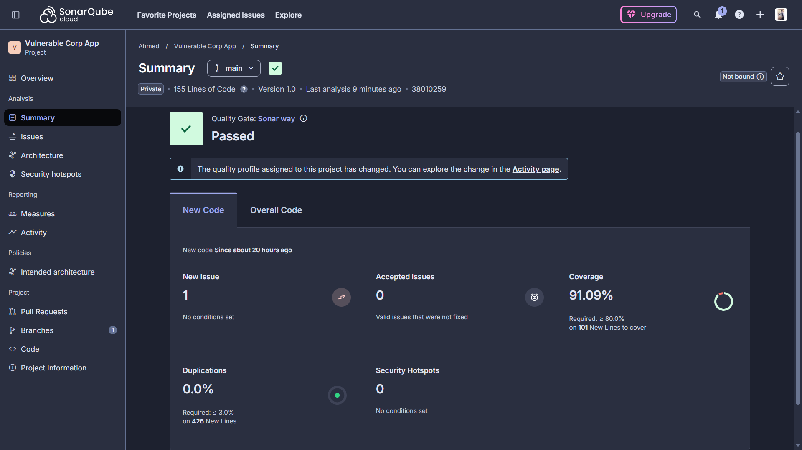

# CorpNet Portal - Remediation and Re-Test Report

## Remediation Summary

| ID | Vulnerability | Root Cause | Remediation | Re-Test Method | Status |
|----|---------------|------------|-------------|----------------|--------|
| VULN-01 | SQL Injection (Authentication) | Direct string concatenation in SQL query. | Refactored `app.py` to use SQLite parameterised queries `(?, ?)`. | `test_security_baseline.py:test_sqli_authentication_bypass_fails` | Passed / Fixed |
| VULN-02 | Stored XSS (Company Feed) | Jinja2 `\| safe` filter disabled HTML output encoding. | Removed `\| safe` filter in `dashboard.html` to enforce Context-Aware Autoescaping. | `test_security_baseline.py:test_xss_payload_is_escaped` | Passed / Fixed |
| VULN-03 | IDOR on Post Deletion | Missing authorization check on backend `/delete/<id>` route. | Enforced RBAC check verifying `session['username'] == post['author']` or admin role. | `test_security_baseline.py:test_idor_deletion_fails` | Passed / Fixed |
| VULN-04 | Hardcoded Secrets | Flask secret key stored in plaintext in source code. | Implemented `python-dotenv` to fetch `SECRET_KEY` from environment variables. | SonarCloud Security Hotspot review and manual verification. | Passed / Fixed |
| VULN-05 | Duplicated String Literals | Inline `/login` and `/dashboard` route literals were repeated across `app.py`. | Introduced `LOGIN_ROUTE` and `DASHBOARD_ROUTE` constants and replaced inline literals throughout `app.py`. | SonarCloud duplicated string literal review and code inspection. | Passed / Fixed |
| VULN-06 | Insecure Network Interface Binding | Flask bound the app to `0.0.0.0`, exposing all network interfaces. | Updated `app.run()` to bind to `127.0.0.1` for localhost-only access. | Manual runtime verification and SonarCloud security blocker review. | Passed / Fixed |

## SonarQube Result

The latest SonarQube Cloud analysis for the CorpNet Portal project shows that the remediation work passed the quality gate.

| Metric | Result |
|--------|--------|
| Quality Gate | Passed |
| New Issues | 1 |
| Accepted Issues | 0 |
| Coverage | 91.09% |
| Duplications | 0.0% |
| Security Hotspots | 0 |

## Re-Test Checklist Before Submission

1. **Unit Testing:** Local `pytest` suite executed and passed successfully validating security controls.
2. **Pipeline Integration:** GitHub Actions DevSecOps Pipeline executed regression tests natively during build phase.
3. **Quality Gate:** SonarCloud analysis reflects 0 Critical/High vulnerabilities.
4. **Evidence Gathering:** Pre-patch exploitation screenshots and post-patch verification screenshots captured in `docs/assets/`.
5. **Configuration Integrity:** Source review confirms shared route constants are used consistently and the app binds only to `127.0.0.1`.
